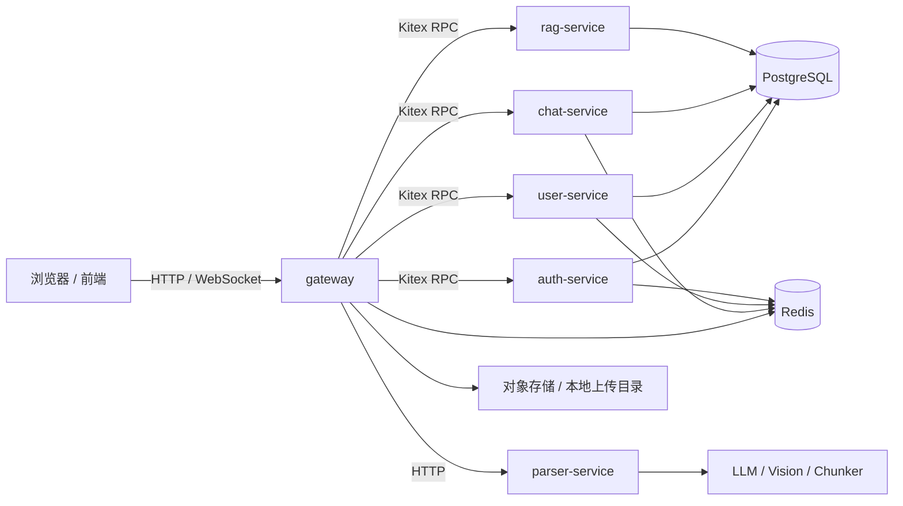

# AIM

AIM 是一个 AI 原生的多人协作聊天平台，采用 Go 微服务架构，围绕注册登录、用户关系、会话管理、消息持久化、WebSocket 实时通信、Bot 接入和 RAG 知识库能力逐步演进。


## 项目定位

- 以聊天为核心，优先保证基础消息链路稳定
- 通过 `gateway` 统一对外提供 HTTP API 和 WebSocket 接入
- 通过 Kitex RPC 在服务之间解耦业务能力
- 通过 PostgreSQL + Redis 承载主数据、在线状态和实时协作
- 预留 Bot 和 RAG 扩展能力，支持后续 AI 原生交互场景

## 当前能力

- 注册、登录、退出登录、Token 刷新、Session 管理
- JWT 校验、token_version 失效控制、账号状态控制
- 用户资料、头像、用户记忆、好友关系、好友分组、在线状态
- 会话列表、单聊定位、群聊创建、加群、退群、成员管理、群公告、禁言
- 文本消息发送、消息持久化、历史消息查询、已读回执、消息撤回
- WebSocket 长连接、消息实时推送、群聊广播
- Bot 管理、会话绑定 Bot、AI 调用日志
- 知识库管理、文档上传、文档解析、切分、检索、会话绑定知识库
- 群聊总结、通知中心、上传文件/图片/语音
- Prometheus + Grafana 监控

## 技术栈

- 后端：Go 1.25.2
- Web 框架：Gin
- RPC：Kitex + Thrift IDL
- ORM：GORM
- 数据库：PostgreSQL + `pgvector`
- 缓存与实时协作：Redis
- 前端：React 19 + Vite + TypeScript
- 文档解析服务：FastAPI + Uvicorn
- 部署：Docker + Docker Compose

## 目录结构

```text
AIM/
├── auth-service/        # 注册、登录、JWT、Session、鉴权
├── chat-service/        # 会话、群聊、消息、Bot、总结
├── gateway/             # HTTP API、WebSocket、鉴权中间件、RPC 调用
├── user-service/        # 用户资料、好友关系、好友分组
├── rag-service/         # 知识库、向量检索、RAG 能力
├── parser-service/      # 文档解析、切分、图文抽取
├── shared/              # 公共配置、错误码、响应、工具
├── idl/                 # Thrift 接口定义
├── frontend/             # 联调用前端
├── deploy/              # PostgreSQL 初始化、监控配置
├── docs/                # API、协议、规格说明
├── docker-compose.yml
└── docker-compose.online.yml
```

## 服务划分

| 服务 | 职责 | 默认端口 | 说明 |
| --- | --- | --- | --- |
| `gateway` | 对外 HTTP API、WebSocket、JWT 中间件、统一响应 | `8080` | 前端默认访问入口 |
| `auth-service` | 注册、登录、Token 刷新、Session、退出登录 | `9002` | 负责认证与账号状态校验 |
| `user-service` | 用户资料、好友关系、好友分组、在线状态 | `9001` | 负责用户侧主数据 |
| `chat-service` | 会话、群聊、成员、消息、Bot、总结 | `9003` | 聊天主链路核心服务 |
| `rag-service` | 知识库、向量检索、RAG 查询 | `9004` | 为 Bot 和知识问答提供上下文 |
| `parser-service` | 文档解析、图片描述、文本切分 | `8000` | 支持 txt/md/pdf/docx/pptx |
| `frontend` | 联调用前端 | `5173` / `80` | 本地开发用 Vite，容器中由 Nginx 提供 |
| `postgres` | 业务数据库 | `5432` | 使用 `pgvector` 镜像 |
| `redis` | 缓存、在线状态、实时事件 | `6379` | 供 gateway 和后端服务共享 |
| `prometheus` | 指标采集 | `9090` | 采集 gateway 指标 |
| `grafana` | 指标看板 | `3000` | 预置 AIM dashboard |

## 架构概览



## 接口约定

- REST 基础前缀：`/api/v1`
- WebSocket 路径：`/ws/chat`
- 统一响应格式：

```json
{
  "code": 0,
  "message": "success",
  "data": {}
}
```

- 认证方式：
  - `Cookie: access_token`
  - `Authorization: Bearer <token>`

## 快速开始

### 1. 准备环境

建议准备以下基础环境：

- Docker 24+
- Docker Compose v2+
- Go 1.25.2 或更高版本
- Node.js 20+（仅当你要本地运行前端）
- Python 3.11+（仅当你要单独运行 `parser-service`）

### 2. 配置环境变量

在仓库根目录准备环境变量，至少需要：

```bash
POSTGRES_PASSWORD=your_postgres_password
JWT_SECRET=your_jwt_secret
```

常用可选变量：

```bash
POSTGRES_USER=aim
POSTGRES_DATABASE=aim
GATEWAY_PORT=8080
FRONTEND_PORT=5173
REDIS_PORT=6379
PROMETHEUS_PORT=9090
GRAFANA_PORT=3000
DOCKER_HUB_MIRROR=
```

AI 和知识库相关变量按需配置：

- `LLM_BASE_URL`
- `LLM_API_KEY`
- `LLM_MODEL`
- `LLM2_BASE_URL`
- `LLM2_API_KEY`
- `LLM2_MODEL`
- `SUMMARY_LLM_BASE_URL`
- `SUMMARY_LLM_API_KEY`
- `SUMMARY_LLM_MODEL`
- `EMBEDDING_BASE_URL`
- `EMBEDDING_API_KEY`
- `EMBEDDING_MODEL`
- `RERANK_BASE_URL`
- `RERANK_API_KEY`
- `RERANK_MODEL`
- `VISION_BASE_URL`
- `VISION_API_KEY`
- `VISION_MODEL`
- `CHUNKER_BASE_URL`
- `CHUNKER_API_KEY`
- `CHUNKER_MODEL`

如果暂时不启用 Bot / RAG / 文档解析，也可以只配置最小必需项，相关功能会保持不可用或退化。

### 3. 启动全部服务

```bash
docker compose up -d --build
```

### 4. 查看状态

```bash
docker compose ps
curl http://127.0.0.1:8080/healthz
```

### 5. 打开页面

- 前端联调用页面：`http://127.0.0.1:5173`
- Gateway API：`http://127.0.0.1:8080`
- Prometheus：`http://127.0.0.1:9090`
- Grafana：`http://127.0.0.1:3000`

## 本地开发

### 前端

`frontend/` 目录是一个独立的 Vite 项目，开发模式下会把 `/api`、`/healthz`、`/uploads` 和 `/ws` 代理到 gateway。

```bash
npm install --prefix frontend
npm run dev --prefix frontend
```

如果 gateway 不在默认地址，可以通过下面的环境变量切换代理目标：

```bash
VITE_GATEWAY_TARGET=http://127.0.0.1:8081 npm run dev --prefix frontend
```

### Go 服务

每个 Go 服务都是独立模块，入口位于各自的 `cmd/server/main.go`。

常见的本地开发流程是：

1. 启动 PostgreSQL 和 Redis
2. 启动 `user-service`、`auth-service`、`chat-service`、`rag-service`
3. 启动 `parser-service`
4. 最后启动 `gateway`
5. 再启动前端联调用页面

如果要做单个服务的调试，通常可以进入对应目录后直接运行 `go run ./cmd/server` 或使用 IDE 的运行配置。

### parser-service

`parser-service` 是独立的 FastAPI 服务，支持：

- `txt`
- `md`
- `pdf`
- `docx`
- `pptx`

本地运行示例：

```bash
pip install -r parser-service/requirements.txt
uvicorn app.main:app --host 127.0.0.1 --port 8000 --app-dir parser-service
```

健康检查地址：

```bash
http://127.0.0.1:8000/healthz
```

## 常用命令

### 后端

```bash
go test ./...
go build ./...
```

### 前端

```bash
npm run build --prefix frontend
```

### Docker

```bash
docker compose logs -f gateway
docker compose down
```

## Docker 部署

### 本地编排

`docker-compose.yml` 适合本地开发和联调，会直接构建源码镜像并启动全量服务。

### 线上编排

`docker-compose.online.yml` 适合部署已经构建好的镜像，默认会从镜像仓库拉取服务镜像，适合 CI/CD 或服务器环境。

线上部署时通常要先准备：

- 已推送的服务镜像
- `JWT_SECRET`
- PostgreSQL 和 Redis 访问参数
- AI / Embedding / Vision / Chunker 的外部服务地址

## 数据与存储

### PostgreSQL

当前仓库默认会创建三个业务库：

- `aim_auth`
- `aim_user`
- `aim_chat`

其中 `aim_chat` 同时承载会话、消息、知识库和 `pgvector` 相关数据。

### Redis

Redis 用于：

- 在线状态
- WebSocket 连接映射
- Bot / 实时事件订阅
- 临时会话与限流数据

### 上传目录

gateway 会把上传内容写入容器内的 `/app/uploads`，并通过 `/uploads` 对外暴露静态访问。

## API 总览

以下是当前对外的主要 API 分组，完整细节以 `docs/api/api-reference.md` 为准。

### Auth

- `POST /api/v1/auth/register`
- `POST /api/v1/auth/login`
- `POST /api/v1/auth/refresh`
- `POST /api/v1/auth/logout`
- `POST /api/v1/auth/logout-all`
- `GET /api/v1/auth/sessions`
- `POST /api/v1/auth/sessions/revoke`

### Users

- `GET /api/v1/users/me`
- `POST /api/v1/users/me/avatar`
- `GET /api/v1/users/memory`
- `POST /api/v1/users/memory`
- `PUT /api/v1/users/memory/:memoryId`
- `GET /api/v1/users/memory/settings`
- `PUT /api/v1/users/memory/settings`

### Uploads

- `POST /api/v1/uploads/images`
- `POST /api/v1/uploads/files`
- `POST /api/v1/uploads/voices`

### Friends

- `GET /api/v1/friends`
- `POST /api/v1/friends`
- `GET /api/v1/friends/requests`
- `POST /api/v1/friends/requests/:requestId/respond`
- `PATCH /api/v1/friends/:friendUserId`
- `DELETE /api/v1/friends/:friendUserId`
- `GET /api/v1/friends/groups`
- `POST /api/v1/friends/groups`
- `GET /api/v1/friends/presence/settings`
- `PUT /api/v1/friends/presence/settings`

### Conversations

- `POST /api/v1/conversations/group`
- `GET /api/v1/conversations`
- `GET /api/v1/conversations/single?targetUserId=...`
- `GET /api/v1/conversations/:conversationId/group`
- `POST /api/v1/conversations/:conversationId/members`
- `POST /api/v1/conversations/:conversationId/members/invite`
- `DELETE /api/v1/conversations/:conversationId/members/me`
- `DELETE /api/v1/conversations/:conversationId/members/:targetUserId`
- `GET /api/v1/conversations/:conversationId/members`
- `POST /api/v1/conversations/:conversationId/owner/transfer`
- `POST /api/v1/conversations/:conversationId/admins`
- `DELETE /api/v1/conversations/:conversationId/admins/:targetUserId`
- `POST /api/v1/conversations/:conversationId/members/:targetUserId/mute`
- `DELETE /api/v1/conversations/:conversationId/members/:targetUserId/mute`
- `POST /api/v1/conversations/:conversationId/mute-all`
- `DELETE /api/v1/conversations/:conversationId/mute-all`
- `PUT /api/v1/conversations/:conversationId/announcement`
- `PUT /api/v1/conversations/:conversationId/avatar`
- `DELETE /api/v1/conversations/:conversationId/group`

### Messages

- `GET /api/v1/conversations/:conversationId/messages`
- `POST /api/v1/conversations/:conversationId/read`
- `POST /api/v1/conversations/:conversationId/messages/:messageId/recall`
- `GET /api/v1/conversations/history/search`
- `POST /api/v1/conversations/:conversationId/summary`

### Bots

- `GET /api/v1/bots`
- `GET /api/v1/bots/custom`
- `POST /api/v1/bots`
- `PUT /api/v1/bots/:botId`
- `DELETE /api/v1/bots/:botId`
- `GET /api/v1/conversations/:conversationId/bots`
- `POST /api/v1/conversations/:conversationId/bots`
- `DELETE /api/v1/conversations/:conversationId/bots/:botId`
- `GET /api/v1/conversations/:conversationId/ai-call-logs`

### Knowledge Bases

- `GET /api/v1/knowledge-bases`
- `POST /api/v1/knowledge-bases`
- `POST /api/v1/knowledge-bases/:knowledgeBaseId/documents/text`
- `POST /api/v1/knowledge-bases/:knowledgeBaseId/documents/file`
- `GET /api/v1/knowledge-bases/:knowledgeBaseId/documents`
- `DELETE /api/v1/knowledge-bases/:knowledgeBaseId/documents/:documentId`
- `POST /api/v1/knowledge-bases/:knowledgeBaseId/search`
- `POST /api/v1/knowledge-bases/:knowledgeBaseId/query`
- `POST /api/v1/conversations/:conversationId/knowledge-bases`
- `GET /api/v1/conversations/:conversationId/knowledge-bases`
- `DELETE /api/v1/conversations/:conversationId/knowledge-bases/:knowledgeBaseId`

### Notifications

- `GET /api/v1/notifications`
- `POST /api/v1/notifications/read-all`
- `POST /api/v1/notifications/:notificationId/read`

## WebSocket 协议

WebSocket 用于实时消息推送和在线协作，当前主要入口是：

```http
GET /ws/chat?token=<access_token>
```

也支持通过 `Cookie: access_token` 或 `Authorization: Bearer <token>` 连接。

### 常见事件

- `CONNECTED`
- `SEND_MESSAGE`
- `MESSAGE_ACK`
- `NEW_MESSAGE`

### 发送示例

```json
{
  "type": "SEND_MESSAGE",
  "clientMsgId": "tmp-123456",
  "data": {
    "conversationId": "c_abc123",
    "content": "hello",
    "replyToId": null
  }
}
```

### 成功 ACK

```json
{
  "type": "MESSAGE_ACK",
  "clientMsgId": "tmp-123456",
  "data": {
    "messageId": 101,
    "status": "SUCCESS"
  }
}
```

### 广播消息

```json
{
  "type": "NEW_MESSAGE",
  "data": {
    "id": 101,
    "conversationId": "c_abc123",
    "senderId": 10001,
    "senderType": "USER",
    "messageType": "TEXT",
    "content": "hello",
    "replyToId": null,
    "status": "NORMAL",
    "createdAt": 1777360800
  }
}
```

更多协议细节请参考 `docs/specs/websocket.md`。

## 环境变量参考

下面按功能分类列出常用变量。具体完整值和默认值建议直接对照 `docker-compose.yml` 与 `docker-compose.online.yml`。

### 基础

- `POSTGRES_USER`
- `POSTGRES_PASSWORD`
- `POSTGRES_DATABASE`
- `JWT_SECRET`
- `DOCKER_HUB_MIRROR`

### Gateway

- `PORT`
- `AUTH_SERVICE_ADDR`
- `USER_SERVICE_ADDR`
- `CHAT_SERVICE_ADDR`
- `RAG_SERVICE_ADDR`
- `PARSER_SERVICE_URL`
- `REDIS_ADDR`
- `UPLOAD_DIR`
- `UPLOAD_PUBLIC_PREFIX`
- `UPLOAD_MAX_BYTES`

### Auth / User / Chat / RAG

- `AUTH_POSTGRES_DSN`
- `USER_POSTGRES_DSN`
- `CHAT_POSTGRES_DSN`
- `RAG_POSTGRES_DSN`
- `REDIS_ADDR`

### LLM / Bot / Summary

- `LLM_BASE_URL`
- `LLM_API_KEY`
- `LLM_MODEL`
- `LLM2_BASE_URL`
- `LLM2_API_KEY`
- `LLM2_MODEL`
- `SUMMARY_LLM_BASE_URL`
- `SUMMARY_LLM_API_KEY`
- `SUMMARY_LLM_MODEL`
- `BOT_CONTEXT_MESSAGES`
- `BOT_TASK_TIMEOUT_SECONDS`

### Embedding / RAG

- `EMBEDDING_BASE_URL`
- `EMBEDDING_API_KEY`
- `EMBEDDING_MODEL`
- `EMBEDDING_DIMENSION`
- `EMBEDDING_TIMEOUT_SECONDS`
- `RAG_CHUNK_SIZE`
- `RAG_CHUNK_OVERLAP`
- `RAG_TOP_K`
- `RAG_SEARCH_TIMEOUT_SECONDS`
- `RERANK_ENABLED`
- `RERANK_BASE_URL`
- `RERANK_API_KEY`
- `RERANK_MODEL`

### Parser / Vision

- `VISION_BASE_URL`
- `VISION_API_KEY`
- `VISION_MODEL`
- `VISION_TIMEOUT_SECONDS`
- `PARSER_ENABLE_LLM_CHUNKING`
- `CHUNKER_BASE_URL`
- `CHUNKER_API_KEY`
- `CHUNKER_MODEL`
- `CHUNKER_TIMEOUT_SECONDS`

## 观测与运维

- Gateway 暴露 `GET /metrics`
- `docker-compose.yml` 中已接入 Prometheus 和 Grafana
- Grafana 默认管理员账号通常为 `admin / admin`，建议在部署时自行修改
- 相关仪表盘和配置位于 `deploy/observability/`

## 文档索引

- `docs/api/api-reference.md`
- `docs/chains/auth-chain.md`
- `docs/chains/bot-rag-chain.md`


