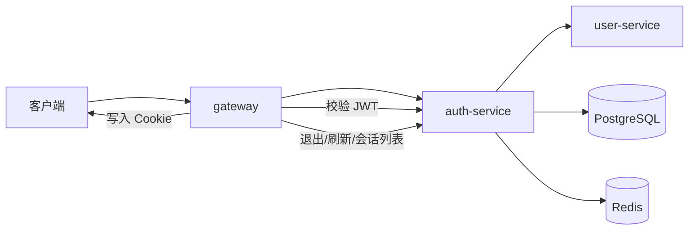

# AIM Auth 链路说明

最后更新：2026-06-04

这份文档专门说明 AIM 的认证链路，重点回答三个问题：

1. 用户是怎样注册和登录的
2. 网关是怎样校验 JWT 的
3. 为什么某些操作会让旧 Token 失效

## 1. 链路目标

Auth 链路的职责不是只发一个 token，而是把以下几件事串成一条稳定的安全链路：

- 统一注册和登录入口
- 发放 `access_token` 与 `refresh_token`
- 维护 session 和设备信息
- 支持 token 刷新与自动旋转
- 支持单设备退出、全部设备退出、会话撤销
- 在服务端主动判断用户状态与 `token_version`

## 2. 参与组件

| 组件 | 作用 |
| --- | --- |
| `gateway` | 对外暴露 `/api/v1/auth/*`，负责参数校验、Cookie 写入和请求转发 |
| `auth-service` | 认证核心，负责注册、登录、刷新、校验、退出、会话列表 |
| `user-service` | 提供用户创建、密码校验、用户状态查询、`token_version` 更新等能力 |
| `postgres` | 保存 session、refresh token、审计事件等认证数据 |
| `redis` | 保存 session 缓存、access token 黑名单、登录失败计数等临时状态 |

## 3. 总体结构



## 4. 对外接口

认证相关的 HTTP API 都从 `gateway` 进入：

- `POST /api/v1/auth/register`
- `POST /api/v1/auth/login`
- `POST /api/v1/auth/refresh`
- `POST /api/v1/auth/logout`
- `POST /api/v1/auth/logout-all`
- `GET /api/v1/auth/sessions`
- `POST /api/v1/auth/sessions/revoke`

WebSocket 连接也会复用同一套访问令牌：

- `GET /ws/chat?token=<access_token>`

## 5. 注册链路

### 5.1 调用顺序

```text
客户端
  -> gateway /auth/register
  -> auth-service.Register
  -> user-service.CreateUser
  -> auth-service 返回用户身份
  -> gateway 返回统一响应
```

### 5.2 关键逻辑

- `gateway` 只做基础参数校验，例如 `aim_id`、`email`、`nickname`、`password`
- `auth-service` 通过 `user-service` 创建用户
- 创建成功后返回 `user_id`、`aim_id`、`role`、`token_version`
- 注册阶段不直接签发登录态，真正的 session 在登录时创建

## 6. 登录链路

### 6.1 调用顺序

```text
客户端提交 email / password / device_name
  -> gateway /auth/login
  -> auth-service.Login
  -> user-service.VerifyCredential
  -> auth-service 生成 session_id
  -> auth-service 生成 access_token / refresh_token
  -> auth-service 写入 session 和 refresh token
  -> auth-service 更新登录状态
  -> gateway 写入 Cookie
```

### 6.2 认证过程

`auth-service` 登录时会做这些事：

- 调用 `user-service.VerifyCredential`
- 判断用户是否处于可用状态
- 生成随机 `session_id`
- 生成新的 `refresh_token`
- 用 JWT 签发 `access_token`
- 把 session 和 refresh token 写入数据库事务
- 把 session 缓存写入 Redis
- 通知 `user-service` 更新最近登录 IP

### 6.3 登录后写入的 Cookie

`gateway` 会把登录态写进浏览器：

- `access_token`
- `refresh_token`
- `device_id`

其中：

- `access_token` 和 `refresh_token` 都是 HttpOnly
- `refresh_token` 的作用范围只限于刷新接口
- `device_id` 用于关联设备和会话，方便刷新校验与会话管理

## 7. JWT 校验链路

### 7.1 请求进入网关后的处理

```text
客户端携带 Cookie 或 Authorization Header
  -> gateway middleware.Auth
  -> auth-service.ValidateToken
  -> 校验通过后把身份写入上下文
  -> 后续 handler 复用 auth context
```

### 7.2 `gateway` 的取 token 规则

`gateway` 会按以下顺序取访问令牌：

1. 先读 `access_token` Cookie
2. 如果没有，再读 `Authorization: Bearer <token>`

### 7.3 `auth-service.ValidateToken` 的校验项

`ValidateToken` 不只是验签，它会继续检查：

- JWT 签名是否合法
- access token 是否在黑名单中
- session 是否存在
- session 是否仍处于 active 状态
- JWT 中的 `user_id`、`session_id`、`token_id` 是否和 session 缓存一致
- 用户是否仍然正常
- 用户表里的 `token_version` 是否和 JWT 一致

只要其中任一步失败，网关都会把请求视为未登录或 token 无效。

## 8. 刷新链路

### 8.1 调用顺序

```text
客户端访问 /auth/refresh
  -> gateway 读取 refresh_token 和 device_id
  -> auth-service.RefreshToken
  -> 校验 refresh token 是否存在、是否过期、是否被复用
  -> 校验 session 是否可用
  -> 重新签发 access_token / refresh_token
  -> gateway 覆盖 Cookie
```

### 8.2 刷新时的安全机制

刷新链路里最重要的是“旋转”和“复用检测”：

- refresh token 每次刷新后都会生成新值
- 老的 refresh token 会被标记为已使用
- 如果旧 refresh token 被再次提交，系统会判定为复用攻击
- 一旦发现复用，服务会撤销该用户的所有 session，并提升 `token_version`

这意味着：

- 旧 access token 会马上失效
- 旧 refresh token 也不能再继续使用
- 用户需要重新登录

### 8.3 刷新失败的常见原因

- refresh token 缺失
- device_id 缺失
- refresh token 已过期
- refresh token 已被使用或撤销
- session 已被退出或撤销
- 设备或浏览器指纹不一致
- 用户状态已被禁用

## 9. 退出与会话管理

### 9.1 当前会话退出

```text
客户端调用 /auth/logout
  -> gateway 转发给 auth-service
  -> auth-service 根据 access_token 找到 session
  -> 撤销当前 session
  -> gateway 清理 Cookie
```

当前会话退出的目标是让这一条登录态失效，而不是影响所有设备。

### 9.2 退出全部设备

```text
客户端调用 /auth/logout-all
  -> gateway 读取当前登录用户
  -> auth-service 校验密码
  -> 撤销该用户的所有 session
  -> 提升 token_version
  -> gateway 清理当前 Cookie
```

这一步会让该用户历史上的 access token 全部失效。

### 9.3 撤销单个会话

```text
客户端调用 /auth/sessions/revoke
  -> auth-service 校验当前用户密码
  -> 校验目标 session 是否属于当前用户
  -> 撤销目标 session
```

如果被撤销的是当前会话，网关会顺手清理当前 Cookie。

### 9.4 会话列表

`GET /auth/sessions` 会返回当前用户的会话列表，包括：

- `session_id`
- `device_id`
- `device_name`
- `user_agent`
- `login_ip`
- `last_ip`
- `status`
- 是否为当前会话
- 创建时间和最近活跃时间

## 10. 关键数据

### 10.1 JWT 载荷

JWT 至少会包含：

- `user_id`
- `aim_id`
- `role`
- `token_version`
- `session_id`
- `token_id`

### 10.2 Session

会话数据会保存：

- 会话 ID
- 用户 ID
- 设备 ID
- 设备名称
- 浏览器/系统信息
- 登录 IP
- 最近活跃 IP
- 访问 token 当前 JTI
- 访问 token 过期时间

### 10.3 Refresh Token

refresh token 会保存：

- session_id
- user_id
- token hash
- 状态
- 过期时间
- 是否已使用
- 是否发生复用

## 11. 失效规则

以下任意情况都会让旧 token 失效：

- 修改密码
- 退出全部设备
- 检测到 refresh token 复用
- 管理员强制下线
- 用户被封禁
- 用户状态变更为不可用

实现上依赖两层控制：

1. session / refresh token 的状态管理
2. 用户表里的 `token_version`

## 12. 安全边界

- 前端传来的身份信息不能直接信任
- `gateway` 负责入口鉴权，但最终权限判断仍以业务服务为准
- `auth-service` 是 token 与 session 的唯一裁决者
- `user-service` 是用户状态与密码校验的唯一来源

## 13. 排障顺序

如果 auth 链路出问题，建议按这个顺序排查：

1. 检查 `gateway` 是否启动
2. 检查 `auth-service` 是否健康
3. 检查 `JWT_SECRET` 是否一致
4. 检查 `redis` 是否可用
5. 检查 `user-service` 是否能正确返回用户状态
6. 检查浏览器是否带上了 Cookie

