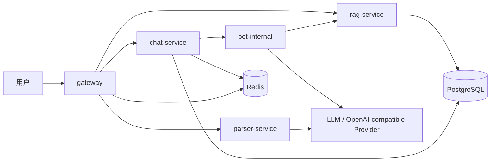

# AIM Bot 与 RAG 链路说明

最后更新：2026-06-04

这份文档专门说明“知识库怎么喂给 Bot”这条链路，包含三部分：

1. 知识库如何进入系统
2. 知识库如何绑定到会话
3. 用户 @Bot 之后，Bot 如何把知识库内容喂给模型并写回消息表

## 1. 这条链路的目标

AIM 的 RAG 不是独立展示页，而是给 Bot 提供上下文增强能力。目标是让 Bot 能够：

- 基于会话绑定的知识库回答问题
- 在单文档阅读、多文档综合、事实检索三类场景中切换
- 保留聊天上下文、最近消息和用户记忆
- 把回答重新写回统一的 `message` 表
- 输出可追溯的 AI 调用日志

## 2. 参与组件

| 组件 | 作用 |
| --- | --- |
| `gateway` | 对外暴露知识库、Bot、总结、上传和 WebSocket 相关接口 |
| `chat-service` | 会话、消息、Bot 触发、Bot 回复写入、会话绑定关系 |
| `bot-internal` | Bot 触发、Prompt 组装、RAG 检索、知识工作流、AI 日志 |
| `rag-service` | 知识库、文档、chunk、向量检索、会话绑定关系 |
| `parser-service` | 文件解析、图片描述、文本切分 |
| `llm provider` | Bot 回复、知识规划、摘要、重写和引用生成 |
| `redis` | Bot 回复流、实时事件、短期上下文缓存 |
| `postgres` | 知识库、文档、chunk、会话绑定、消息、Bot、日志 |

## 3. 总体结构



## 4. 这条链路分成两段

### 4.1 知识进入阶段

这一步负责把原始文档变成可检索的知识片段。

### 4.2 Bot 使用阶段

这一步负责在用户 @Bot 或主动提问时，把会话上下文和知识库片段拼进模型输入，最后生成 Bot 回复。

---

## 5. 知识进入阶段

### 5.1 创建知识库

```text
客户端
  -> gateway POST /api/v1/knowledge-bases
  -> rag-service.CreateKnowledgeBase
  -> 保存知识库元数据
```

知识库是用户自己的资源，不是 Bot 独占资源。后续 Bot 是否能访问，取决于会话绑定关系和权限范围。

### 5.2 添加文本知识

```text
客户端
  -> gateway POST /api/v1/knowledge-bases/:id/documents/text
  -> rag-service 接收文本
  -> 切分为 chunks
  -> 生成 embedding
  -> 写入向量和文档表
```

适合直接导入 Markdown、说明文档、FAQ、FAQ 片段和结构化文本。

### 5.3 添加文件知识

```text
客户端
  -> gateway POST /api/v1/knowledge-bases/:id/documents/file
  -> gateway 把上传文件放到临时文件
  -> parser-service 解析文件
  -> rag-service 接收解析结果
  -> 切分、向量化、落库
```

parser-service 目前支持：

- `txt`
- `md`
- `pdf`
- `docx`
- `pptx`

对于图片较多的文件，解析器还会尝试做图片描述，再把描述内容一并带入切分流程。

### 5.4 文档状态

文档导入通常会经历：

- `PENDING`
- `PROCESSING`
- `READY`
- `FAILED`

前端和通知中心会收到导入进度提示。

### 5.5 检索模型

rag-service 会把文档切成 chunk，并保存：

- chunk 内容
- chunk 所属文档
- 向量
- 文档标题
- 文档状态

后续检索时，Bot 不是直接读整篇文档，而是先召回 chunk，再交给 rerank 和 LLM 处理。

---

## 6. 会话绑定阶段

### 6.1 绑定知识库到会话

```text
客户端
  -> gateway POST /api/v1/conversations/:conversationId/knowledge-bases
  -> rag-service.BindConversationKnowledgeBase
  -> 写入 conversation_knowledge_base
```

绑定后，这个会话里的 Bot 才能把对应知识库纳入检索范围。

### 6.2 解绑知识库

解绑后，新的 Bot 请求就不会再使用该知识库的内容。

### 6.3 多知识库

一个会话可以绑定多个知识库。Bot 检索时会先拿到该会话绑定的全部知识库，再逐个搜索、合并、去重和重排。

---

## 7. Bot 触发阶段

### 7.1 消息先落库

Bot 不是在前端直接生成的。聊天消息先进入 `chat-service`：

```text
客户端发送消息
  -> gateway WebSocket / HTTP
  -> chat-service 保存 message
  -> 更新 conversation.last_message_id / last_message_at
```

### 7.2 是否触发 Bot

消息落库后，`chat-service` 会判断：

- 这条消息是否包含 Bot 触发词
- 当前会话是否绑定了可用 Bot
- 当前 Bot 是否处于启用状态

如果命中，就会异步调用 `bot-internal`：

```text
chat-service
  -> bot.HandleMention(...)
```

### 7.3 异步执行

Bot 处理是异步的，避免阻塞主消息链路。即使 Bot 生成失败，用户的原始消息也已经成功入库。

---

## 8. Bot 解析与路由

### 8.1 识别目标 Bot

bot-internal 会根据消息内容里的 mention token、别名和会话绑定列表，找到真正要回答的 Bot。

### 8.2 会话中的 Bot 绑定

Bot 绑定信息来自 `conversation_bot`，同时还要配合 `conversation_member` 里的 Bot 成员记录。

### 8.3 允许的管理操作

当前会话里的 Bot 可以由群主或管理员添加、移除，也可以为单个会话覆盖：

- 显示名
- mentionName
- aliases
- modelName
- permissionScope

### 8.4 权限范围

Bot 目前使用的权限范围主要有三类：

- `CONVERSATION_ONLY`
- `KNOWLEDGE_BASE_ONLY`
- `CONVERSATION_AND_KB`

含义是：

- `CONVERSATION_ONLY`：只读最近聊天上下文，不查知识库
- `KNOWLEDGE_BASE_ONLY`：只查知识库，适合问答、资料检索
- `CONVERSATION_AND_KB`：聊天上下文和知识库一起用

---

## 9. RAG 检索链路

### 9.1 会话绑定知识库列表

bot-internal 在开始检索之前，会先向 rag-service 请求当前会话绑定了哪些知识库。

### 9.2 针对每个知识库搜索

对每个绑定知识库分别搜索：

- 输入当前问题
- 设定 `topK`
- 召回 chunk
- 合并结果

### 9.3 去重、阈值和重排

检索结果会经过：

1. 按内容去重
2. 按分数阈值过滤
3. 可选 rerank
4. 再截断到最终 recall 窗口

这样做的目标是减少噪音，提升最终喂给模型的内容质量。

### 9.4 失败降级

如果没有绑定知识库，或者没有检索到足够的 chunk，Bot 不会盲目编造答案，而是返回明确的兜底语句。

---

## 10. 知识工作流

Bot 不只是把 chunk 塞进 prompt，它还会先判断用户想要什么类型的知识回答。

### 10.1 三种工作流

| 类型 | 适用场景 |
| --- | --- |
| `LOOKUP` | 事实检索、局部问答、定义类问题 |
| `READ` | 单文档总结、提炼、章节理解、原文引用 |
| `SYNTHESIZE` | 多文档比较、跨文档总结、综合分析 |

### 10.2 路由方式

工作流有两层判断：

1. 先用规则快速判断
2. 规则不够明确时，再让 LLM 做路由规划

### 10.3 结果类型

不同工作流会产出不同回答风格：

- `answer`
- `summary`
- `compare`
- `extract`
- `outline`
- `table`
- `timeline`
- `quiz`
- `rewrite`

### 10.4 活跃知识上下文

bot-internal 会保留短期上下文，方便下一句追问继续沿用上一次的文档和主题，而不是每次都从头搜索。

---

## 11. Prompt 组装

Bot 最终发给模型的输入通常包含：

- 近期会话消息
- 用户最新提问
- replyTo 的上下文
- 会话内用户显示名
- 最近话题摘要
- 长期记忆
- RAG chunk
- 系统 prompt

如果会话开启知识库，prompt 会明显更偏向“基于证据回答”，而不是纯聊天。

---

## 12. 回复落库

Bot 生成回答后，不会直接发给前端，而是：

```text
LLM 输出
  -> bot-internal 组装 Bot 消息
  -> 写入 message 表
  -> 更新 conversation.last_message_id / last_message_at
  -> 发布实时事件
  -> 前端通过 WebSocket 收到 NEW_MESSAGE
```

### 12.1 Bot 消息的存储形态

Bot 回复写入统一消息表，并使用：

- `sender_type = BOT`
- `message_type = BOT_REPLY`

### 12.2 AI 调用日志

每次 Bot 调用都会记录到 `ai_call_log`，用于：

- 查看调用成功与失败
- 统计 token 使用量
- 追踪模型和 provider
- 排查 prompt 和检索问题

---

## 13. 直接查询知识库的链路

除了 @Bot 之外，前端还可以直接调用知识库查询接口：

- `POST /api/v1/knowledge-bases/:knowledgeBaseId/query`

这条链路适合：

- 调试检索结果
- 单独查看知识库回答效果
- 验证某个知识库是否能被 Bot 正确利用

它会返回：

- `plan`
- `answer`
- `model`
- `citations`
- `quotes`
- `chunks`

---

## 14. 常见失败场景

### 14.1 没有绑定知识库

Bot 会提示当前会话没有可用知识库，而不是尝试编造答案。

### 14.2 知识库检索为空

Bot 会返回“没有检索到可用资料”之类的明确提示。

### 14.3 LLM 调用失败

如果是知识库专用回答，系统会尽量返回一个可理解的兜底答复，并把失败写进 AI 日志。

### 14.4 Bot 触发但没有匹配到目标

如果 mention token 没有对应 Bot，系统会静默跳过，不会污染主消息链路。

### 14.5 超出并发或额度

Bot 还有并发和 token 限额控制，避免单个会话把平台资源打爆。

---

## 15. 安全边界

这条链路里最重要的边界是：

- Bot 只能查当前会话绑定的知识库
- Bot 不能跨会话读取未授权数据
- 用户是否能访问知识库，最终由后端服务决定
- 前端上传的参数不能直接作为权限依据

---

## 16. 运行相关的环境变量

常见变量包括：

- `LLM_BASE_URL`
- `LLM_API_KEY`
- `LLM_MODEL`
- `LLM2_BASE_URL`
- `LLM2_API_KEY`
- `LLM2_MODEL`
- `EMBEDDING_BASE_URL`
- `EMBEDDING_API_KEY`
- `EMBEDDING_MODEL`
- `RERANK_ENABLED`
- `RERANK_BASE_URL`
- `RERANK_API_KEY`
- `RERANK_MODEL`
- `VISION_BASE_URL`
- `VISION_API_KEY`
- `VISION_MODEL`
- `CHUNKER_BASE_URL`
- `CHUNKER_API_KEY`
- `CHUNKER_MODEL`
- `BOT_CONTEXT_MESSAGES`
- `BOT_TASK_TIMEOUT_SECONDS`
- `RAG_TOP_K`
- `RAG_SEARCH_TIMEOUT_SECONDS`

---

## 17. 排障顺序

如果这条链路出问题，建议按下面顺序排查：

1. `gateway` 是否健康
2. `chat-service` 是否在线
3. `rag-service` 是否可访问
4. `parser-service` 是否可访问
5. 知识库是否真的绑定到了会话
6. Bot 是否已加入会话并处于启用状态
7. LLM / Embedding / Rerank 的 API Key 和 Base URL 是否配置正确
8. `ai_call_log` 中是否有失败记录

